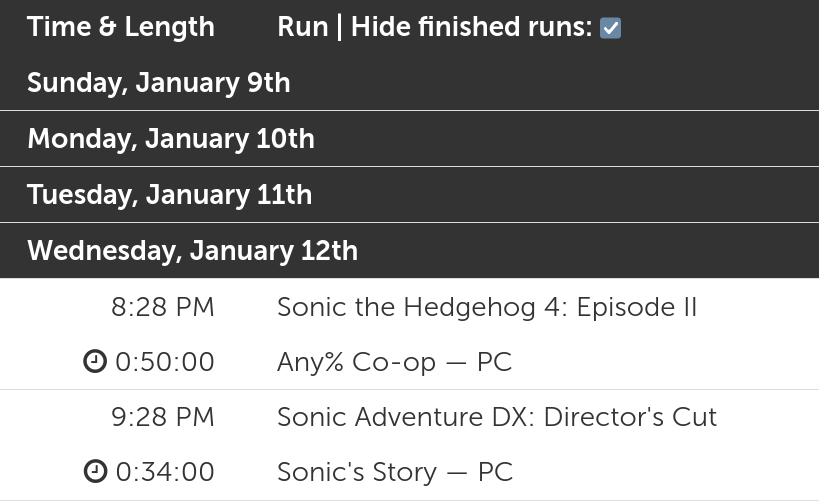

# GDQ Schedule Enhancement

[GDQ Schedule](https://gamesdonequick.com/schedule) page has a run table, which is very handy and even converts run times to your timezone. However, it does not hide the runs that are already finished, so when the end of the marathon is near, you have to scroll each time to the end of the table. This extension adds a simple checkbox that allows you to hide said runs

## Available at
* [Chrome Web Store](https://chrome.google.com/webstore/detail/gdq-schedule-enhancement/omchjbogjpeegneefacnhaddmclohmon)
* [Mozilla Addons](https://addons.mozilla.org/en-US/firefox/addon/gdq-schedule-enhancement/)